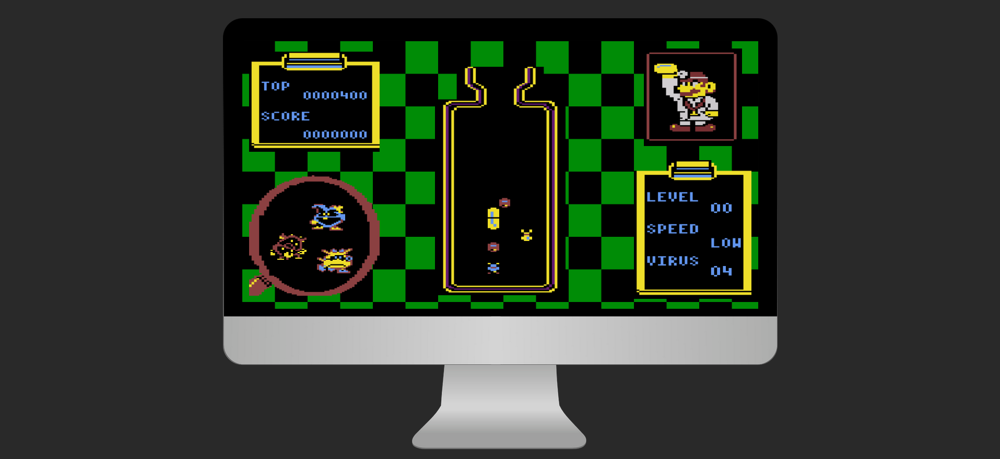
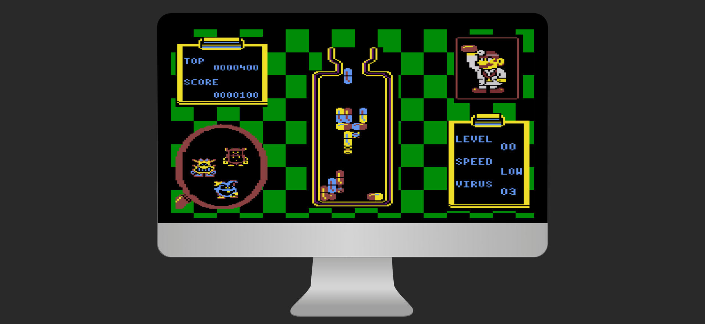

# Dr-Mario &middot; 

Old atari game clone  made in Javascript, HTML5 and SCSS. Check out live: https://michalbie.github.io/Dr-Mario/

## Game rules
Your goal is to destroy all viruses on each level. You can it by stacking 3 cells near the virus of the same color (horizontally and vertically). You can see next pill in the queue on top of the doctor hand. If pills reach the bottle neck - you lose. Each level is much harder and you can play infinite number of levels.

## Controls
You move the pill by left and right arrow. You can also rotate the pill by up arrow (rotate left) and right shift (rotate right). When you press down arrow, the pill goes vertically down without the possibility to move it to the left or right.

## App look

## Contribution
If you want to contribute, please create new pull request or open an issue. Copy my .editorconfig file and follow rules from this link [Style Guide](https://github.com/bevacqua/js 
"bavacqua style guide").
